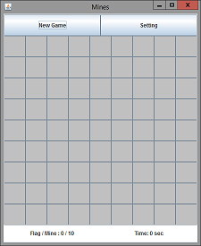

Mines
-----

[](assets/SS.png)

大学2年の課題で作ったマインスイーパーです。<br />
設定により、盤面サイズと爆弾数が変更可能です。

## 実行

```
$ javac -encoding utf-8 Mines.java
$ java Mines
```

## 開発環境

- Java 1.6
- Swing

## ライセンス
MIT-License<br />
Copyright (c) 2012 Pine Mizune